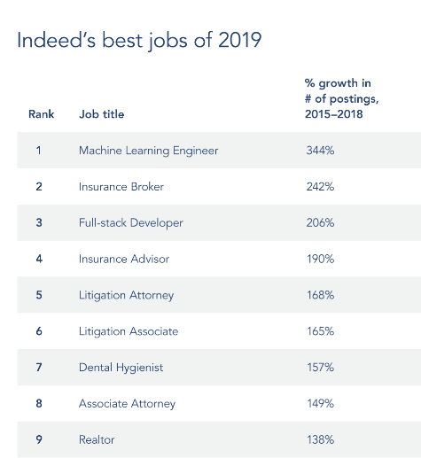

.. raw:: html

   <link rel="stylesheet" href="_static/revealjs/css/theme/white.css">
   <link rel="stylesheet" href="_static/default.css">

Machine Learning Engineering
=============================

         
Welcome
----------
.. revealjs_slide::
   :theme: white

.. revealjs_fragments::
   
   * CS 5781 - Machine Learning Engineering
   * A new class for an emerging topic
   * Completely designed for virtual teaching

Class Context
---------------

.. revealjs_fragments::

   * Development of deep learning models
   * Deep learning models in industrial context
   * Programming large systems 

Current Context: MLE
---------------------------------------

     
Future Context: Self-Driving
-----------------------------

.. raw:: html
  
   <video width="640" height="480" controls>
         <source src="   https://www.tesla.com/sites/default/files/images/careers/autopilot/network.mp4" type="video/mp4">
   </video>
   

Future Context: Multi-Agent 
---------------------------------------

.. raw:: html

   <iframe width="640" height="480" src="https://www.youtube.com/embed/HcZ48JDamyk" frameborder="0" allow="accelerometer; autoplay; encrypted-media; gyroscope; picture-in-picture" allowfullscreen></iframe>

Future Context: Image Gen
----------------------------------

.. raw:: html

   <iframe width="640" height="480" src="https://www.youtube.com/embed/XOxxPcy5Gr4" frameborder="0" allow="accelerometer; autoplay; encrypted-media; gyroscope; picture-in-picture" allowfullscreen></iframe>
         
   

Future Context: Code Gen
----------------------------------

  .. raw:: html

    <blockquote style="align:center" class="twitter-tweet"> </blockquote>

    

Future Challenges: ML in Society
----------------------------------

  `A Case for Banning Facial Recognition <https://www.nytimes.com/2020/06/09/technology/facial-recognition-software.html?auth=login-email&login=email>`_

  .. raw:: html
         
   <video width="320" height="240" controls>
         <source src="https://vp.nyt.com/video/2020/06/09/86966_1_09ontech-video_wg_1080p.mp4" type="video/mp4">
   </video>

Question
----------------------------------

  What does it look like to be an engineer in this context?
   
   
Personal Introduction
======================

   
Hi!
----------------

.. image:: https://avatars0.githubusercontent.com/u/35882?s=460&v=4
   :width: 300

       
Academic Work
-------------------------------

.. revealjs_fragments::

   * Website: http://rush-nlp.com/
   * Area of Study: Natural Language Processing (NLP)
   * Area of Study: Deep Learning

Academic Work: Projects
-------------------------------

.. revealjs_fragments::
   
   * Automatic text summarization
   * Accurate math OCR
   * Machine learning on cell phones
      
   
My Path
-------------------------------

.. revealjs_fragments::

   * Coder ->  Student -> Industry -> Professor
   * Professor at Harvard for 5 years
   * Moved to Cornell Tech last year!

Intro: Engagement
---------------

.. revealjs_fragments::

   * Open-source development projects for NLP
   * Part-time at `Hugging Face <https://github.com/huggingface/transformers>`_
   
TA
-----------

.. revealjs_fragments::
   * Ge Gao
   * PhD Student in NLP / Machine Learning
   
Class Introduction
===================

Class Focus
-------------------------------

.. revealjs_fragments::
   
     * **Machine Learning** Engineering
     * Machine Learning **Engineering**
     * Focus: software engineering behind machine learning
       
Applied Machine Learning 
--------------------------

.. revealjs_fragments::
   
     * Coverage of different models and learning setups
     * Focus on algorithms and mathematical underpinnings
     * Broad coverage of the field and its future
        
       
Machine Learning Engineering 
--------------------------------

.. revealjs_fragments::
   
     * Coverage of only one model (neural network)
     * Focus on implementation details and design
     * Deep dive into its positives / negatives 
     * (For those who care about the weeds)

Machine Learning
------------------

.. revealjs_fragments::

   * Rich and interesting field
   * Buildnig models is a core skill
   * Probabilistic reasoning for decision making

Hidden Factor
------------------

Many recent successes based on:

* Hardware
* Tooling
* Brute-force search

Skill Set of a ML Engineer
--------------------------

.. revealjs_fragments::
   
     * Math
     * Experimentation
     * *Systems*

Machine Learning Systems
=========================

Machine Learning Engineering
------------------------------

.. revealjs_fragments::

   * ML practitioners build large-scale mathematical systems.
   * Tooling has been key to speed up ML development.
   * Most work done in *Deep Learning frameworks*.
     
Deep Learning Frameworks
----------------------------

.. revealjs_fragments::
   
   * Implement mathematical functions as efficient code
   * Provide organization and structure to ML projects
   * Allow for easy training and deployment
   * Think: "Programming language for machine learning"
     
Popular Frameworks
----------------------------
     
.. revealjs_fragments::

   * `TensorFlow <https://tensorflow.org/>`_ 

     .. image:: https://www.gstatic.com/devrel-devsite/prod/v1241c04ebcb2127897d6c18221acbd64e7ed5c46e5217fd83dd808e592c47bf6/tensorflow/images/logo.png
        :align: center
        :width: 100px
                
   * `PyTorch <https://pytorch.org/>`_ (Tool used at Tech)

     .. image::  data:image/png;base64,iVBORw0KGgoAAAANSUhEUgAAAOEAAADhCAMAAAAJbSJIAAAA2FBMVEX///8AAAAYGBiOjo6Hh4ff398UFBQcHByqqqoNDQ0ICAjo6Ohra2v+///8/PwhISE0NDT4//9NTU3y8vJ7e3tUVFTY2Ni9vb3Nzc3t7e1jY2P+JQD0//8RERFcXFywsLD9JgChoaGXl5dAQEDR0dH+AABxcXE5OTktLS3Gxsa5uLl+fn75z8f+k4f59/P/Qyj/inz84Nf6m4r9RzX4qZr67er5xrn9fnH+NBHys6f75Nn02cr+Ox/8d2X62dL9pJf+bFX/Y0/+XD77lYr9+P/9PRX+s638Tz4a5NUbAAAHY0lEQVR4nO2Ze3uaWBDGGRQREAhivCGKMSQaE3uxuWy3abPb3e73/0Y7BxAPqNldS7dtnvf35A/AA87rzJkLURQAAAAAAAAAAAAAAAAAAAAAAAAAAAAAAAAAAAAAAAAAAAAAAAAAAAAAAAAAAAAAAABfg/29DfjWOJ7zvU2QcbTmoOJHejerip/4VbSJtEof6Ng30SGFTunsfwnntlqxQu8mfnXQh9P2acpwObEOrOmNW3sYTo41qFqFtm2/jiOh0Obj3c/rpKY0DKJZb+8zptTYA9WOtalihezBKFqzQs8brXYl1kxXpZQGHw33paQpUb4kX00/hkL2mxAYvPEU5e363Z6UWjPDi4FlWd3+pEWGS6d7JPqalTJgb3YG2YnmH2tVlQodj0M0eHjjOd51HMRCaImaaXQ2x4MLcqmuPFNZmmTUv96qSn0oPCgE2t4bPrrdF6W5QlZWI9c4lG8EP5hC2xF7MAg+eiLJeHf31+zKkeMUfCT7kDXOdJpkh0XS87JCZ9ffzs51+RuTw1ShI186kjRE32e7b+R5zuiG92LBkSWFTQovuOewtMLX5ue7PtSaneGwddaVrkyGbL9VG7dbTV/o4D9tejEetmr9dOtmPtSay4t6z3luVzyPY/8SP4g9aKdVgn9K71McX48Kq0oK+9QYJ02HXOzOiS6VvQq7QyJDVA6a9TfXko6lyXlXDekksb47Jgp5lUlu3d8oXJzyxdAgd3+F+hfYo9voIQreSx7zfuW9+OGZKGVjqHGqKBNST5WtrzsGTfcqZI9nxUNX8+JxqpLVJL4eEnXSuGjo6SpDp7NMYT0rObpOV8dK9B6DKProSUHgjT7FUfzpcJQqwodD9jbn1G0u8HVd9/cpnPKy2cTyfW16Yrq0zBVOiNoLx+l2evKqwaI+Tx7bVt1LotaVNbCmrq6rR7bh9m0UxG9LFdBeR1GxgytF6ZRMUS7Ya2f51QnlSySFIqLd3HHOkk96mUJ3Tq181UKs2ljhT0UEsUKaZTtX4+PpkQrfifJQVnjHTrw+qFARuXTBZp2TfpLfOW7Q+a5CxZmpclvTMrJbWGGjvckfjjLXRYndnCmpwrCTJ5i6IXb+UQqfouDeLncxzoeAw1Qq/OV6qM+TO9pCaYpG+myzWlZ4JV1n/Hm2o1ihFOI9fmI5W/I+3BbdBf+Y/1lcyqsg/rLTw3hPQfAoy5Z96ItQu0rs4eywCbQz2oaRrHDYKCRcXpfecqoaUl/UalBzj8LtT2AdrdAJgvh6p4fxboLgN3nGYIVLDh3ft66WuimatuRTX80SgC3CLE8F8j7kxFjoTLUssjnTdHNNvqubO/1LVQqjPQpt723MCgs+dF2uSoJQN7feyivEedIDZFclhSzosviFc70hgu9Utl/bhL1MVQofoviXXR/eB8FTMUpdnatxGJpE7lLLcoLINWq6y1jqIl8tKeQFpQyRGV5QyCmrvWNaRQqV36P4847C0V9B8HpUUKjPWkNuvGrNfiHoTvTEDN9VL7fLJYVJ5dxneEkh9w5lKlJo3wTReufq+yCK74q51MwrXyGcmqIyiowplytJYXfHdi4CO1HKPrz8VlFqi4HwTnYXR6D3OoiCwgzFCrOiVvL3QNXnviiGpjROSQoHpLuFG7hczLNMI9lv6vpOy1KVQmcdBeuVXC8cHhIfosfCsq3CMhchNylaMRblauHqVBglu5SW7oJCTj9JC1GgKoUj7l84q+SlgYfD2w9RVBr0DytMNhoXw4V0TVa4NPjO3HZHqZtc+ZSSQl7Fur+NQuWP0SO3aI+rTCLPw+/XwUPwuRC4hxWKadgYXKqFUJQVnpOrWhvjHUVrZP15USGvynu+DZVFqb36kxWt71gii7RX7wJOM092eQI+qHBKjYtQ9lNpthiH4Tj5zM7MTlNSUaHSDnW39GKkKh+K8eIVS4zXn+8+Xn+5j+LoIX4qv1A8HKWKT27DLb5RKcwWFrcI7exjrW2YWWotKdQMXQ8n6a/kT5JGqTqFK+/2KeYhMYq5g2N9QXzvlTvVZxQqrdAt9f2SQjvpClSjddXvX7UMldpZOS0p5NaaW/HLzrRZG7qUNOfVKeTsYn/5k/NNJAjiV3eeXS5O9Wfe7C7ymW9Dk0ie8bsnpIbJ8G5QZ/PktlF6k9adk6pzY2g21LS4FlZY1JgfoSzH87y7ex57g4e/Xl97e94IT1qtg/9/4La51FRejcdS/efPJu2GUDjvbF9FLcftcq89OU1WGbMzTdzUGY+3O3Mwa+8k2/+C49hcL1a3tyvb80pJ5h/p0eEIzp7OP8P5oi+/mdtvrN9dLM7l0v9j/M+WJ8DuP6/6iRmU56MXhqiHx74j+klwTrin+d5GfCuSbMG17+JrktyPTFK6LV2X3re8LJyTet/q8dizPJT7f25sHpvEmyndnL1EeQlNFmiYNPZfpAcTBr2z+ll5qHuBvFgHAgAAAAAAAAAAAAAAAAAAAAAAAAAAAAAAAAAAAAAAAAAAAAAAAAAAAAAAAAAAAAAAAABUwt8jJIj+aIPfWwAAAABJRU5ErkJggg==
        :align: center
        :width: 100px

Deep Learning Frameworks
----------------------------

Example of code in PyTorch. ::

  class Network(torch.nn.Module):
    def __init__(self):
      super().__init__()
      self.layer1 = Linear(2, HIDDEN)
      self.layer2 = Linear(HIDDEN, HIDDEN)
      self.layer3 = Linear(HIDDEN, 1)

    def forward(self, x):
      h = self.layer1.forward(x).relu()
      h = self.layer2.forward(h).relu()
      return self.layer3.forward(h).sigmoid()

Deep Learning Frameworks
----------------------------
.. revealjs_fragments::
   
   * Used for all the major projects shown.
   * Provide easy user programming interface
   * Connect to fast hardware under the hood

ML Day-to-Day
---------------
.. revealjs_fragments::

   * Data scientist or ML practitioners and use these systems
   * However, an ML Engineer should really know what is going on...

CS 5781 - 2020
----------------

   We're going to build PyTorch.

Course Outline
=================

My Learning Philophy
-------------------------

.. revealjs_fragments::
   * Engineering is learned through implementing
   * You don't understand it until the tests pass
   * Build your own demos

Learning Objectives
---------------------

.. revealjs_fragments::
   
   * Reason about the requirements for large system systems
   * Be comfortable designing and testing mathematical code
   * Gain confidence reading large open-source codebases

Learning Non-Objectives
------------------------

.. revealjs_fragments::
   
   * Rigorous understanding of mathematical foundations
   * Development of new or creative models
   * Details of state-of-the-art ML systems 
     
Course Style
-----------------

.. revealjs_fragments::
   
   * Highly applied, focus on building
   * Project directed, questions from students
   * Interactive and grounded in the project

Course Outline
=================

     
PyTorch
---------

.. revealjs_fragments::

   * Big codebase on CPU and GPU
   * Large team of professional developers
   * Used in thousands of academic papers
   * Deployed by Facebook, Uber, Tesla, Microsoft, OpenAI ... 
     
Challenge
-------------------------------------

.. revealjs_fragments::
   * Q: How are you going to build PyTorch?
   * A: One commit at a time    

Course Project
-------------------------------------

.. revealjs_fragments::
   
   * 5 modules walking you through the process
   * Each covers a different topic in MLE
   * Final module yields a full image recognition system.

   
Module 0 - Foundations
-------------------------

.. image:: figs/Module/module.png
           :align: center

Module 1 - Autodifferentiation
-------------------------------

.. image:: figs/Autograd/backprop4.png
           :align: center

Module 2 - Tensors
-------------------------------

.. image:: figs/Tensors/stride4.png
           :align: center

Module 3 - Efficiency
-------------------------------

.. image:: figs/gpu/threadid@3x.png
           :align: center

Module 4 - Networks
-----------------------

.. image:: figs/mnist/orig.png
           :width: 400px
           :align: center
.. image:: figs/mnist/mnist2.png
           :width: 400px
           :align: center
                   
.. image:: figs/mnist/mnist5.png
           :width: 400px
           :align: center

.. image:: figs/mnist/mnist4.png
           :width: 400px
           :align: center

Grading
-----------------------

.. revealjs_fragments::

   * Assignments - Completion and Correctness
   * In-Class Quizzes
   * Assignments are done individually

Course Structure
-----------------------

.. revealjs_fragments::
   
   * Co-working session on Fridays
   * Lectures Tuesday Morning and Thursday Evening
   * Thursday Morning practical session

Caveats
=========

Course Prerequisites
-----------------------

.. revealjs_fragments::

   * Programming experience
   * Mathematical notation / calculus experience
   * Willingness to debug
   * https://forms.gle/j1VZjwDUVCEqubi36

     
Next Lecture
-----------------------

.. revealjs_fragments::
   
   * Getting dev setup
   * Getting started for Module-0
   * Come ready to program.
   
Q & A
==========
          
